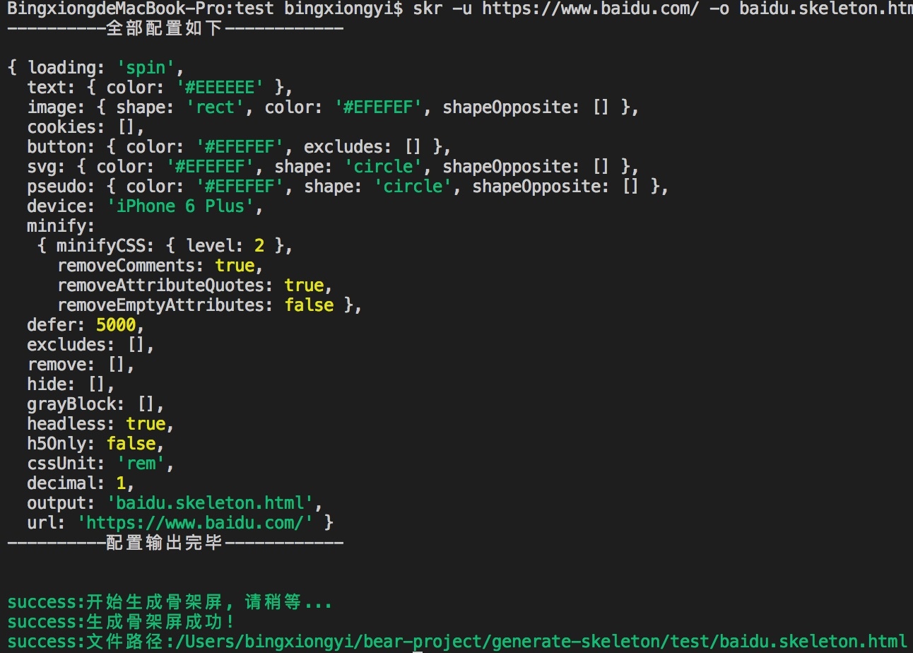
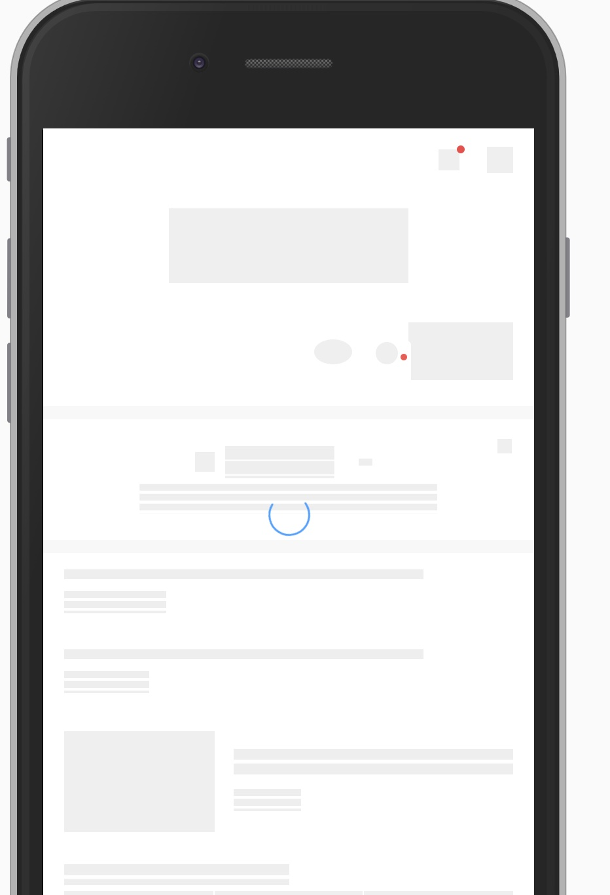

# generate-skeleton &middot; [](https://github.com/yibingxiong/generate-skeleton/blob/master/LICENSE)

generate-skeleton 是一个生成一个可访问的网页的骨架屏样式的命令行工具

- **核心依赖:** generate-skeleton的核心依赖饿了么前端团队做的[page-skeleton-webpack-plugin](https://github.com/ElemeFE/page-skeleton-webpack-plugin)和[puppeteer](https://github.com/GoogleChrome/puppeteer), 本工具所做的只是将page-skeleton-webpack-plugin改成了一个命令行工具

- **主要特性:** 可以使用简单命令生成一个页面的骨架屏html和css, 可以配置哪些元素应该被灰化, 哪些该被隐藏. 关于其生成原理, 大家可以参看Jocs大神的演讲稿[一种自动化生成骨架屏的方案](https://github.com/Jocs/jocs.github.io/issues/22)

## 安装

```bash
npm install -g generate-skeleton 
```

## 快速试用

```bash
skr -u https://www.baidu.com/ -o baidu.skeleton.html
```

运行之后的结果为

;

运行后直接直接在指定的路径生成骨架屏css和html.

我们把他放到静态服务器看下, 结果如下



发现跟百度的那个结构还是有比较大的差别的. 可能是没把他原来的样式拿过的原因, 这里不去深究了. 总之, 通过这样的一行命令是可以生成的.

## 选项

这个命令有比较多的选项, 直接运行`skr --help`就可以看到帮助文档, 里面有详细说明. 这里简单列举下.

- --url(-u): 指定你要生成骨架屏的页面的url, 比如生成百度的那就是 -u https://www.baidu.com/, 只要你本地可以跑的就行, 不一定是先上的

- --output(-o): 生成的骨架屏要保存的路径

- --loading: loading的效果, 有spin,chiaroscuro,shine这么三个值

- --file(-f): 指定你的配置文件路径, 这个文件必须是json的, 后面再说明

- --hide: 指定你要隐藏元素的css选择器, 逗号分隔, 比如--hide .hide1,#hide2

- --grayBlock: 指定你要灰化的元素的css选择器, 逗号分隔, 比如 --grayBlock .gray,#gray2

- --debug: 是不是要开debug模式, 一般用不到

- --headless: 是不是要关闭无头模式, 有这个的话会开个浏览器, 一般不用

- --cssUnit: css的单位, rem|px|vw|vh, 默认给的rem

- --device: 设备名称, 这个和下面那个是pupeteer要用的, 你可以找他的文档看看

- --decimal: 缩放比

**说明**

其实上边这些配置很多是page-skeleton-webpack-plugin里用的, 我只是照着搬过来而已, 有问题的话可以直接看他们[文档](https://github.com/ElemeFE/page-skeleton-webpack-plugin/blob/master/README.md)

另外, 出了--url和--output是必须的外, 其他的都是可选的, 有默认值的.

--file是指定一个配置文件, 其实基本就是page-skeleton-webpack-plugin的配置文件, 我这里直接贴一个他们的配置文件给你参考, 具体啥意思直接看人家文档去.

```javascript
{
    // ['spin', 'chiaroscuro', 'shine'],
    loading: 'spin',
    text: {
        color: '#EEEEEE'
    },
    image: {
        // `rect` | `circle`
        shape: 'rect',
        color: '#EFEFEF',
        shapeOpposite: []
    },
    cookies: [],
    button: {
        color: '#EFEFEF',
        excludes: []
    },
    svg: {
        // or transparent
        color: '#EFEFEF',
        // circle | rect
        shape: 'circle',
        shapeOpposite: []
    },
    pseudo: {
        // or transparent
        color: '#EFEFEF',
        // circle | rect
        shape: 'circle',
        shapeOpposite: []
    },
    device: 'iPhone 6 Plus',
    minify: {
        minifyCSS: { level: 2 },
        removeComments: true,
        removeAttributeQuotes: true,
        removeEmptyAttributes: false
    },
    defer: 5000,
    excludes: [],
    remove: [],
    hide: [],
    grayBlock: [],
    headless: true,
    h5Only: false,
    // or 'vw|vh|vmin|vmax'
    cssUnit: 'rem',
    decimal: 1
}
```

还有一点要注意, 配置的优先级是 命令行里的配置优先级高于配置文件, 比如配置文件中a为1, 命令行a为2, 使用时a为2.

## 贡献

我写的很渣, 什么单元测试, eslint, ci啥的一个没搞, bug估计也不少, 所以欢迎感兴趣的同学贡献代码, 贡献之前请先帮忙把单元测试, eslint搞起来

## License

generate-skeleton is [MIT licensed](./LICENSE).